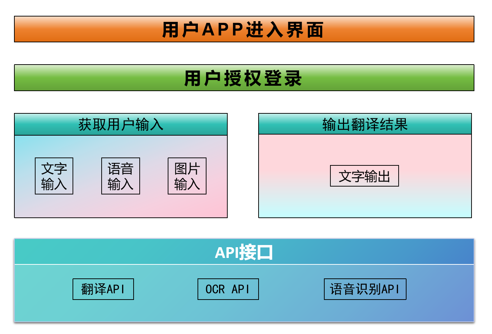

<h1 align="center">系统分析与设计文档</h1>

## 一、系统分析 

架构示意图如下：

  
### 1.1 用户界面层（Presentation Layer）
  负责与用户交互，接收用户输入并展示数据。
- 包括用户界面和用户交互组件，负责接收用户输入和展示输出结果。
- 使用Android中的Activities、Fragments、Views等组件构建界面，通过事件监听器处理用户输入。

### 1.2 应用层（Application Layer）
 处理业务逻辑，协调不同模块之间的交互。
- 包括业务逻辑和数据处理，负责调用后端服务进行翻译、语音合成、语音识别等操作。
- 将用户输入传递给后端服务，并处理返回的结果，包括翻译结果的展示和保存、历史记录的管理等。

### 1.3 数据访问层（Data Access Layer）
负责与数据存储交互，进行数据库操作。

- 包括后端服务的集成和数据存储，负责与后端服务进行通信并存储应用数据。
- 使用网络请求库与后端服务进行通信，使用数据库或文件系统存储历史记录等数据。

## 二、组件设计

在翻译APP中，主要分为以下几个关键组件：

- **翻译管理组件**：负责处理用户的翻译请求和翻译结果的输出。
- **语音处理组件**：负责语音输入的识别和语音输出的生成。
- **图像处理组件**：负责图像中文字的识别和翻译。
- **用户界面组件**：负责展示用户界面和交互逻辑。
- **数据访问组件**：负责与数据库的交互，存取用户数据和翻译记录。
- **网络通信组件**：负责管理APP与服务器以及第三方服务API的通信。

## 三、组件接口设计

### 翻译管理组件

- **接口**：ITranslationManager
- **方法**：
  - `translateText(String inputText, String languagePair)`: 接受文本和语言对，返回翻译结果。
  - `translateImage(File imageFile)`: 接受图像文件，返回识别并翻译后的文本。

### 语音处理组件

- **接口**：IVoiceProcessor
- **方法**：
  - `recognizeSpeech(File audioFile)`: 将语音文件转为文本。
  - `synthesizeSpeech(String text, String language)`: 将文本转换为语音。

### 图像处理组件

- **接口**：IImageProcessor
- **方法**：
  - `recognizeText(File imageFile)`: 从图像中识别文字。

### 用户界面组件

- **接口**：IUserInterface
- **方法**：
  - `displayTranslation(String translation)`: 展示翻译结果。
  - `getUserInput()`: 获取用户输入。

### 数据访问组件

- **接口**：IDataAccess
- **方法**：
  - `saveTranslationRecord(TranslationRecord record)`: 保存翻译记录到数据库。
  - `getTranslationHistory()`: 获取翻译历史记录。

### 网络通信组件

- **接口**：INetworkManager
- **方法**：
  - `sendRequest(RequestData requestData)`: 发送网络请求。
  - `fetchResponse()`: 获取服务器响应。

## 四、系统流程分析

### 用户发起翻译请求流程

1. **用户输入**：用户在界面上输入文本或通过语音输入/图像上传。
2. **输入处理**：
   - 如果是文本，直接传送至翻译管理组件。
   - 如果是语音，语音处理组件识别语音并转换为文本。
   - 如果是图像，图像处理组件识别图像中的文字。
3. **翻译处理**：翻译管理组件接收处理后的文本，并根据用户选择的目标语言调用网络通信组件与翻译API交互。
4. **结果输出**：翻译结果通过用户界面组件返回给用户，展示翻译文本或语音输出。
5. **数据存储**：翻译记录通过数据访问组件存储在数据库中，包括输入文本、翻译结果和时间戳。

### 异常处理

- **错误处理**：任何组件在执行过程中遇到错误，应通过用户界面组件向用户反馈错误信息。
- **网络异常**：网络通信组件在网络请求失败时，通知用户检查网络连接。
